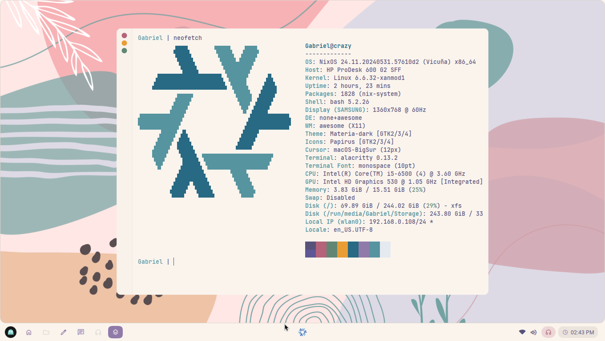

# Nixmoment

## Plasma version


## Aether shell version


> Aether is the new environment based in awm im ~~slowly~~ making

> *Update*: Im liking more my plasma workspace tbh.

Here's my effort to keep myself on nixos while having a comfy workstation.

Thing is im primarily using plasma so don't enable aether shell options
yet since it's a work in progress and won't work cuz it's a private repo.

The objectives of this config is to get myself in an environment that
contains all the software i need and that installs all the bloatware i need
in a declarative way.

## Installation

This config comes with some special file such as `<root>/config.nix` which specifies a little
bit of ~~tracking~~ information about you, such as your username, your ofc secure password, etc.

so keep an eye of it if you want, the defaults should work, but will setup my username.

### Formatting the disks

you can use xfs if you want, it's my fav so imma put instructions here, but it shouldn't matter
if you use btrfs or whatever else.

```sh
mkfs.xfs -f /dev/sda2 -L NIXOSROOT
mkfs.fat -F /dev/sda1 -n NIXOSBOOT

mount /dev/disk/by-label/NIXOSROOT /mnt/
mount /dev/disk/by-label/NIXOSBOOT /mnt/efi --mkdir
```

> Yes efi folder is at /efi since i like it to be there, if you wanna change the path, checkout [boot.nix](./crazy/core/boot.nix)

### Configuring the config XD

So now you can start cloning the config and generating the hardware configuration files, example:

```sh
mkdir -pv /mnt/home/<yourusernamehere>/

# installs git and git lfs temporarily
nix-shell -p git{,-lfs}

# yes it's .crazy
git clone https://github.com/alphatechnolog/nixmoment.git --recurse-submodules /mnt/home/<yourusernamehere>/.crazy

# !$ means the path
cd !$

# download some huge files
git lfs install
git lfs pull
```

So now you can generate the hardware info

```sh
nixos-generate-config --show-hardware-config > misc/hardware-configuration.nix
```

Then adjust your config.nix as your liking

```sh
nix-shell -p vim --run 'vim config.nix'
```

You can change the colorscheme of some apps (it will mostly change aether shell colors when done), and change your hostname, username, etc

> [!IMPORTANT]
> Disable aether shell options there, check for `<root>.modules.homeManager.aetherShell` since it's a WIP
> and because the source code is in a private repo atm, it will just cause fails to happen.

## Building the system

When everything is done, just issue

```sh
nixos-install --root /mnt --flake '.#crazy'
```

> Report if you get some errors, cuz i could have forgotten some step lmao

Then just reboot on your system, another rebuild may be needed if you want it to recognise your windows installation or something.
At least that happened to me.
